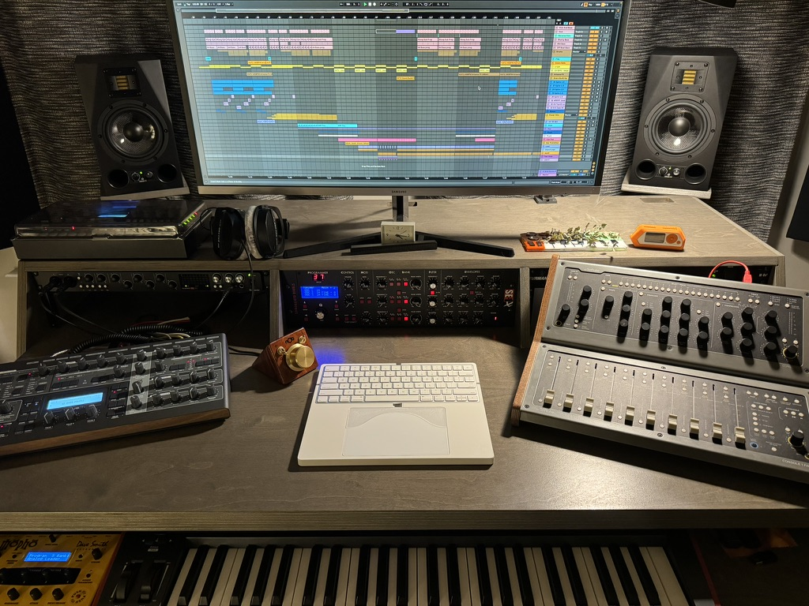
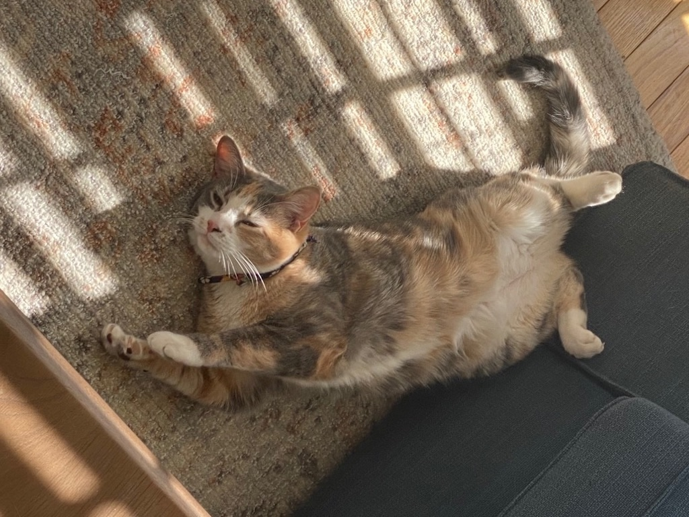
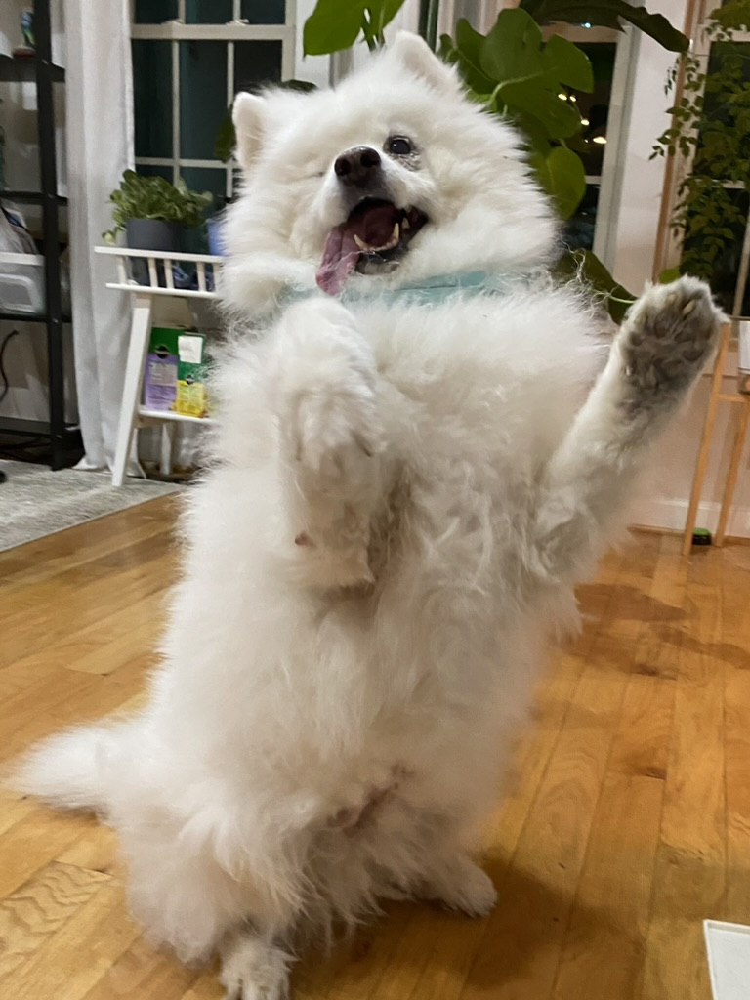

# More About Me (The Fun Side)

Hi! I'm really gald you are interested in learning more about me! Here you will find the fun side of me, i.e. the non-research/work related stuff. For my professional portfolio, feel free to checkout either my [Resume/CV](documents/Heyuan_Huang_Resume.pdf) or [the research section](research.md) of this website. 

## My Side Gig

By using the word “gig,” I'm hoping to give you some hint :) I'm also a electronic dance music producer, and more specially, I make Trance music.  I go by artist name [**RayD8**](https://www.beatport.com/artist/rayd8/384697), which is pronounced exactly like the word "radiate." (If you have read my CV or research, you would know why I chose this name)

  

What is trance music, you ask? Well, it's a bit hard to just define it in a few words, but think it of some sort of melodic techno but fast, more energetic, and more euphoric. Simply search "Trance playlist" on YouTube, for instance, can give you a good list of trending tracks. Feel free to explore them and see if you like them :)

I wouldn't call it my side gig if I'm not a "published writer." I have been releasing music with recording labels for more than 3 years, and, you can find music on any major platform. Just search "RayD8" in your spotify, apple music, YouTube music, etc., and my logo should pop up.

Below is a photo of my current studio. My proud and joy!

  

## My Pets

How would life be complete without pets? We (I and my girlfriend) have a cat (American shorthair diluted calico) **AND** a dog (Samoyed). Feel free to find more about them below!

### The cat Morphe (pronounced morph-ee)

A 2-year-old female calico. She grew up with our dog, so picked up some wonderful dog habits, like responding to call (verbally and she would come), fetch, and enjoyment of belly rub! She would roll up her belly when she is happy, and you can pet her belly for a minute or two before the chance of being bitten rises :) She is also **very verbal**, and would chat with you some time! Here is a picture of her. Indulge yourself with come cuteness! 

  

### The dog, Tang Tang (which means Candy Candy in Chinese)

A 9-year-old female Samoyed that we got from our freinds when she was 2 years old. She had a rough life, sadly: she had broken one of her forelegs when she was only a puppy, and although her former owner managed to the leg, her mobility had been sadly restricted. Tang Tang was also unfortunately born with dry eye condition, and had sadly her right eye, but we managed to save her left eye. We strive to keep her as happy and comfortable as possible. Tang Tang also served as Morphe's kitten-sitter and did an excellent job! Here is a photo of the smiling angel!

  

